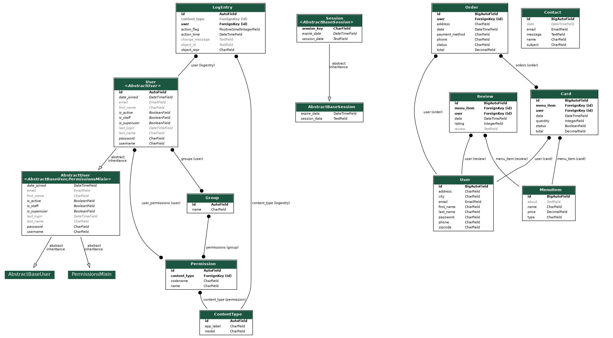
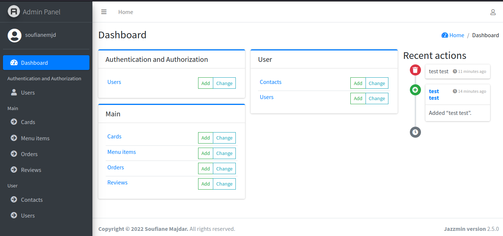

# Pizza Order in Django

## ✨ How to use it

```bash
$ # Get the code
$ get clone https://github.com/Soufiane-Majdar/Pizza-Order-in-Django.git
$ cd izza-Order-in-Django
$
$ # Virtualenv modules installation (Linux)
$ virtualenv env
$ source env/bin/activate
$
$ # Virtualenv modules installation (Windows)
$ virtualenv env
$  .\env\Scripts\activate
$
$ # Install modules (Linux)
$ pip3 install -r requirements.txt
$ # OR (Windows)
$ pip install -r requirements.txt
$
$ # creat a migration
$ python manage.py makemigrations
$ python manage.py migrate
$
$
$ # Start the application
$ python manage.py runserver 
$
$
$ # Access the web app in browser: http://127.0.0.1:8000/
```
## UML



## Demo :

### Admin Panel


